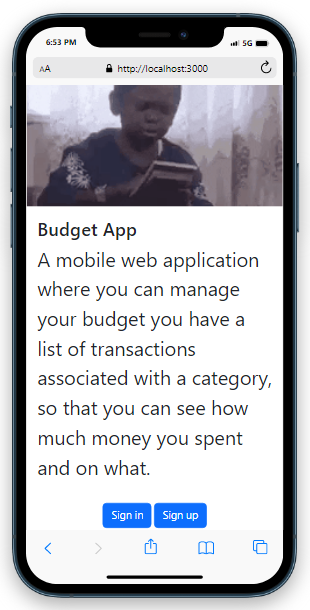
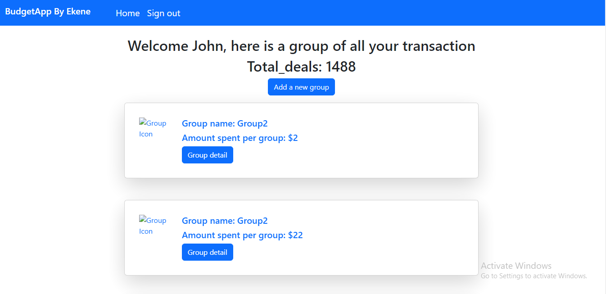

# SuperBudget-app





### Description 
The Super Budget app is a mobile web application where you can manage your budget: you have a list of transactions associated with a category, so that you can see how much money you spent and on what. built with Ruby on Rails

[Live Demo Here](https://ekenebudgetapp.herokuapp.com/) 


### Cloning the project

 git clone https://github.com/ekenecf/Budget-App.git <Your-Build-Directory>
``` 
- cd Budget-app
- rails s
```


## Built with
- Ruby 3.1.2 on Rails 7.0.3.1
- PostgreSQL

## Prerequisites

Vscode or anyother
Setup

## Install
    Ruby
    Rails

### Development Database

```sh
# Load the schema
rails db:schema:load
#----- If you want prefer this approach
# Create the database
rake db:create
# Create database Migration
rails db:migrate
```

### Run

```sh
rails s
```

## Run tests
```sh
bundle install
rspec
```

## Author

👤 **Nwachukwu Ekene**

- GitHub: [@ekenecf](https://github.com/ekenecf)
- LinkedIn: [Nwachukwu-Ekene](https://www.linkedin.com/in/nwachukwuekene/)
- Twitter: [Nwachukwu-Ekene](https://www.twitter.com/ekene070)

## Acknowledgment
For the desgin of this app thanks to the author [Gregoire Vella on Behance.](https://www.behance.net/gallery/31579789/Ballhead-App-(Free-PSDs))

## 🤝 Contributing

Contributions, issues, and feature requests are welcome!

Feel free to check the [issues page](https://github.com/ekenecf/Budget-App/issues).

## Show your support

Give a ⭐️ if you like this project!

## 📝 License

This project is [MIT](/LICENSE) licensed.